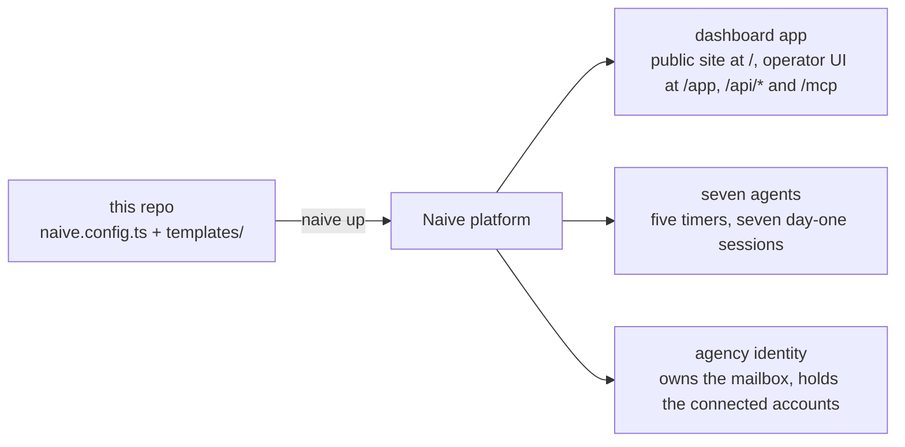

# 🏢 Agency Blueprint

**An entire agency in one repository — clone it, run `naive up`, and the Naive platform
provisions the CRM dashboard, the public website and the crew of agents into your own
organization.**

[](LICENSE)
[](https://www.npmjs.com/package/@usenaive-sdk/blueprints)
[](https://www.npmjs.com/package/@usenaive-sdk/vetta-cli)
[](https://nodejs.org)
[](https://react.dev)

It ships one app with two doors: the agency's public site at `/`, whose copy is data the crew
edits through approvals, and the operator dashboard under `/app` (home, CRM pipeline,
approvals, agents, per-client workspaces) — plus an MCP server that lets any agent operate
the agency, and a crew of seven agents that read the three answers you give at install and
start work the same day.

It comes in **two templates**: `blank`, a working agency with no specialism, and `seo-geo`,
the same agency specialised in search and answer-engine work. One repo carries both — see
[The two templates](#-the-two-templates).

The engine is [`@usenaive-sdk/blueprints`](https://www.npmjs.com/package/@usenaive-sdk/blueprints),
installed from the public npm registry like any other dependency. Nothing here resolves out
of a private workspace: a clone plus `pnpm install` is the whole toolchain.

## 🗺 What `naive up` provisions



- **The one app** (`dashboard`, fullstack, `required`) — this repo's built UI plus a thin
  server that talks to the platform on your behalf. It serves the **public site** at `/`
  (hero · proof strip · services · who we serve · process · pricing · FAQ · contact) and the
  **operator dashboard** under `/app`. The site's copy is a `site_profile` record in the
  app's own store, read by the page over the public, cacheable `GET /api/site` and rewritten
  by the `site-builder` through `dashboard.update_site` — which is held at `ask`, so every
  edit lands on **Approvals** first. The contact form posts to `POST /api/leads`, the one
  other public route, and lands as a CRM lead — one open row per contact and domain, ten new
  leads an hour and at most 200 open ones before the form answers `429`, and the page takes a
  served section only in the seed's shape, within its lengths. The old operator paths (`/crm`, `/approvals`,
  …) redirect to `/app/*`.
- **Seven agents** — the active template's crew, each with a role, a private system prompt,
  a deny-by-default tool allow-list, skills from the platform catalogue, a daily budget, and a
  first message that runs on day one. See [The crew](#-the-crew).
- **The agency identity** (`agency`) — the persona every agent and every schedule acts as. It
  is what owns the agency mailbox and holds any connected account.

That persona is not decoration: identity tools resolve `session → agent → identity →
{inboxes, connected accounts}`, so an agent holding no persona is offered nothing at all from
a mailbox or a connected account, and a scheduled fire without one runs as nobody. It is declared once in
[`naive.config.ts`](naive.config.ts); the schedules name it and a real time zone
([`templates/blank.ts`](templates/blank.ts)), because an omitted zone is UTC by the
platform's default and 08:00 UTC is nobody's Monday morning.

A template may also declare a **per-client crew**, provisioned by the dashboard server when
you onboard a client — their names carry the client's slug, so they are per-client resources
and cannot be declared in `naive.config.ts`. `seo-geo` declares three (`seo-writer--<slug>`,
`geo-optimizer--<slug>`, `audit-runner--<slug>`), published to the studio as `crew_per_client`;
`blank` declares none and runs every client through the agency's own seven.

## 👥 The crew

Both templates declare the same seven; `seo-geo` appends a sentence of search focus to each
prompt and the search skills to the writers' and the researcher's lists. Every prompt opens
with the same paragraph: read `project_context` before anything else — it holds your three
answers in your own words — and treat those answers as the client's, never yours to invent.
Tools marked `*` are held at `ask` and land on **Approvals** before they run.

| Agent | Role | Tools | Skills | Timer (`America/New_York`) | First message (day one) |
|---|---|---|---|---|---|
| `site-builder` | Public site | `web_fetch`, `dashboard.get_site`, `dashboard.update_site*` | `naive/landing-page-copy` | — | Reads the site and rewrites every generic section from the answers; proposes it as one `update_site` call. Invents no case study, testimonial or number. |
| `sales` | Pipeline | `web_search`, `web_fetch`, `dashboard.{list_clients, get_client, create_lead, add_client_note, advance_pipeline}`, `email.inboxes`, `email.read`, `email.send*` | `naive/cold-outreach-drafting`, `naive/crm-hygiene` | weekdays 08:30 | Fifteen prospects matching the ideal-client answer, filed as leads with a why-now; openers drafted (not sent) for the best three. |
| `client-manager` | Delivery | `dashboard.{list_clients, get_client, create_lead, get_calendar, list_posts, create_draft_post, schedule_post, add_client_note}`, `email.inboxes`, `email.read`, `email.send*` | `naive/client-onboarding` | Mon 08:00 | The onboarding checklist and a first-30-days calendar template for the service you sell. |
| `content-writer` | Content | `web_search`, `web_fetch`, `dashboard.{list_clients, get_client, create_lead, list_posts, create_draft_post, add_client_note, get_site}` | `naive/seo-content-brief` (+ `naive/geo-answer-blocks` in `seo-geo`) | Tue + Thu 07:00 | A four-week editorial calendar for the agency's own blog, and the first post as a pending draft. |
| `content-reviser` | Revisions | `web_fetch`, `dashboard.{list_clients, create_lead, list_posts, create_draft_post, get_site}` | `naive/content-revision` | Wed 09:00 | Reads the site and every published post; files revisions for the three weakest as pending drafts. |
| `gap-researcher` | Research | `web_search`, `web_fetch`, `dashboard.{list_clients, create_lead, add_client_note, get_site}` | `naive/keyword-gap-analysis` (+ `naive/geo-answer-blocks` in `seo-geo`) | Fri 09:00 | Three competitors compared against your site; the ten highest-value misses filed as a gap report. |
| `proposal-writer` | Proposals | `web_fetch`, `dashboard.{list_clients, get_client, create_lead, add_client_note}` | `naive/proposal-writing` | — | The standard proposal skeleton and three package tiers — priced from the pricing answer when the template asked one (`blank`); `seo-geo` asks competitors instead, so its tiers are scoped without prices until the operator answers `ask_operator`. |

Every agent also holds `project_context` and `read_skill` (`allow`) and the two doors to you,
`ask_operator*` and `request_tools*`. No agent holds `approve_post`, `start_agent_session` or
`social.post`: approving, spending and publishing stay with you.

### The three questions

A template asks at most three questions before anything is provisioned (the engine refuses a
fourth), and the answers become the project's context — what every agent reads first, and
what the dashboard's home screen shows.

| | `blank` | `seo-geo` |
|---|---|---|
| `offer` | What does your agency sell, and to whom? | What does your agency sell, and to whom? (search and answer-engine work) |
| `ideal_client` | Who is your ideal client — industry, size, geography? | same |
| third | `pricing` — How do you price — retainer / project / hourly — and your typical range? | `competitors` — Which three competitors do your clients lose to in search? |

Edit an answer later through the platform (`PATCH /v1/blueprints/installs/{id}`); the crew
reads the new value on its next turn, no re-apply needed.

### Day one

Each of the seven carries an `intake` — a first message the apply starts a session with,
capped at **$20** (`20_000_000` µUSD) each. An intake runs *once*, on the apply that creates
the agent, and never again on a later apply, so seven of them are a one-off ceiling of
**$140** on install day — not a monthly line.

What recurs is the separate per-agent `budget`: **$60** a day each
(`cap_micro_usd: 60_000_000`, `period: "day"`), no more than $20 of it on any one task. That
is a ceiling, not a bill — nothing spends against it unless a timer fires or you start a
session, and the crew's declared timers are ten scheduled runs a week in all, each capped at
$10 per fire.

Day one leaves you: a rewritten site waiting on Approvals, fifteen leads, an onboarding
checklist, an editorial calendar and a first draft, three revisions, a gap report and a
proposal skeleton — all filed on the agency's own client record or as pending drafts, nothing
sent, nothing published. The dashboard's home screen (`/app`) shows each of those sessions and
what it is waiting on.

### The skills

Skills are the platform's, referenced as `naive/<slug>` and resolved from the catalogue at
session start: `landing-page-copy`, `cold-outreach-drafting`, `crm-hygiene`,
`client-onboarding`, `seo-content-brief`, `content-revision`, `keyword-gap-analysis`,
`proposal-writing`, and — in `seo-geo` — `geo-answer-blocks`. Pin a version with
`naive/<slug>@N`; unpinned reads the newest.

## 🚀 Get started

You need Node 22 or newer (Vite's floor is `^20.19 || >=22.12`, and `pnpm serve` runs the
server through Node's own TypeScript stripping), [pnpm](https://pnpm.io), and a platform API
key.

```sh
npm install -g @usenaive-sdk/vetta-cli          # installs the `naive` command
git clone https://github.com/usenaive/agency-blueprint.git my-agency
cd my-agency
pnpm install

export NAIVE_API_KEY=sk_...                     # your platform API key
naive claim                                     # bind this clone to your organization
pnpm build                                      # site + dashboard + api → dist/
naive up                                        # provision everything in naive.config.ts
```

`naive up` reads [`naive.config.ts`](naive.config.ts) and reconciles your organization
against it, reporting each resource as `created | updated | unchanged | deleted | refused`.
It is idempotent — every resource is keyed by its name, so re-running it is always safe — and
it ships an app only when that app's build output actually changed, which is why `pnpm build`
comes first.

`NAIVE_API_KEY` is declared on the dashboard app as `{ from_env }`, so it is read from your
shell at apply time and never written into this repository. An unset variable refuses the
apply by name rather than deploying a dashboard that cannot reach the platform.

**Then give the agency a mailbox.** `naive up` provisions the persona but not an inbox on it —
an inbox is an address, and the address is yours to choose. Provision one on the `agency`
identity, on your organization's system domain or a domain you have verified:

```sh
naive identity list                                       # find the agency persona's idn_...
naive identity domain list                                # the system domain's dom_...
naive identity email provision --identity idn_... --domain dom_... --address hello@<domain>
```

From the next turn on, `sales` and `client-manager` are offered `email.inboxes` and `email.read` for it, and
`email.send` (held at `ask`) where the deployment's mail provider is configured. Until then the
sales agent's weekday pass finds no mailbox tool and says so — it will not read anything else
as the mailbox, and it asks you for one through **Approvals** rather than guessing.

| Script | What it does |
|---|---|
| `pnpm install` | installs the toolchain, including the blueprint engine and the `naive` CLI |
| `pnpm build` | builds the one app to `dist/`: the site at `index.html`, the dashboard at `app/index.html`, the server at `dist/api/app.js` |
| `pnpm test` | the whole vitest suite — routes, MCP, templates, screens, config, the built bundles |
| `pnpm typecheck` | `tsc --noEmit` over the whole repo |
| `pnpm dev` | hot-reloading UI — the site at `/`, the dashboard at `/app` |
| `pnpm serve` | the dashboard server on `:8789`, over a JSON file store |

### 🔐 Getting into the deployed dashboard

Every `/api/*` route on the deployment is behind the app's `DASHBOARD_TOKEN`, because the CRM
holds client names, domains, contacts and their email addresses, the roster holds system
prompts, and the queue is a writable surface. You never have to invent that value and you
never see it: `naive.config.ts` declares it `{ generate: true }`, the platform makes one on
the apply that creates the app, and no route anywhere returns an app secret.

You get in by opening the dashboard from the studio that installed it. That mints a
short-lived entry ticket, the browser posts it to `POST /api/enter`, and the server trades it
for an `HttpOnly` session cookie the browser then attaches to every call to its own API by
itself — the credential never passes through the DOM, a URL or storage. Deployed, the cookie
is `Secure; SameSite=None; Partitioned`, because the studio also shows the dashboard inside
its own page and a `Lax` cookie never reaches a framed cross-site document; partitioned
(CHIPS), the framed and the top-level dashboard each sign in once and never see each other's
cookie. Since such a cookie rides on cross-site requests, a cookie-authenticated write
(`POST`/`PUT`/`PATCH`/`DELETE` to a gated route) must also be the dashboard's own —
`Sec-Fetch-Site: same-origin` or `none`, or failing that an `Origin` on this host — or it is
`403 cross-site request refused`; bearers, reads and `/api/enter` are not asked. On a laptop the
cookie stays `SameSite=Lax` without `Secure`. A deployment that somehow has no token answers
`503 not configured — set DASHBOARD_TOKEN` on every `/api/*` route rather than serving your CRM
to whoever finds the URL.

Opening `/app` directly, or from a browser the studio cannot hand back — a colleague's, or one
signed out of the studio too — lands on a sign-in screen rather than the dashboard: the SPA
asks `GET /api/session` before it mounts a single screen, sends a first-time visitor to the
studio once (the `naive.entry.attempted` flag in `sessionStorage`), and otherwise offers an
**Open in the Studio** link and a **dashboard password** form. Inside the studio's frame it
never bounces — the link opens the studio in the top window instead. That password is the second
generated secret, `DASHBOARD_PASSWORD` — the one credential a person may hold. The studio's
Access panel shows it (audited) and rotates it; the form posts it to the same `/api/enter`,
which compares it in constant time and answers with the identical cookie. A refused form goes
back to `/app?entry=denied`; a refused JSON body is the `403` it always was. `/api/session`
returns `{ authenticated, studio_url, password_enabled }` — the studio link is built from the
platform's `NAIVE_STUDIO_URL` and `NAIVE_APP_ID` and is `null` when either is unset; no
secret is in it.

`/mcp` is untouched by all of this: agents carry their own bearer, which is not yours and
does not open `/api/*`.

## 🧩 The two templates

A **blueprint** is the machine, and it is shared: the screens, `/api/*`, `/mcp`, the store,
the operator gate, the build and deploy, the approval flow. A **template** is data: the
agents and their prompts, their tool allow-lists, the deliverable kinds, the schedules, the
demo seed, the words the screens print.

| Template | The agency it runs | Deliverable kinds | Per-client crew |
|---|---|---|---|
| `blank` | No specialism — the seven, generic | post, page, report, audit | none |
| `seo-geo` | Search: audits, SERP work, answer-engine optimization | article, landing page, answer block, SERP report, audit | `seo-writer`, `geo-optimizer`, `audit-runner` |

This repo carries **both**, so switching is an edit and a re-apply — never a re-clone, and
never a new app:

```ts
// templates/index.ts
export const TEMPLATE: TemplateName = "blank";   // was "seo-geo"
```

```sh
pnpm build && naive up
```

**Switching widens, and never narrows.** Agents the new template declares are created. Agents
only the old one declared are *reported* and left standing — `naive up` lists them, and the
dashboard lists any per-client crew it did not provision on that client's Agents tab. Nothing
is deleted by a switch: deleting an agent takes an explicit `removed:` tombstone in
`naive.config.ts`. Your own rows are never touched — clients, deliverables, connections, the
app, its URL and its MCP token all survive a switch, and a deliverable filed under the old
template keeps its kind.

The dashboard shows which template is active on **Settings**, and does not offer a switcher:
a template is data compiled into the app *and* its config, so switching is the edit above
plus a re-apply, and a button could not honestly do it.

## 🖥 Operating the agency

| Screen (under `/app`) | What it does |
|---|---|
| Home | Your three answers (from the latest applied install's context), day one's sessions, approvals due, the crew with each timer's next fire, pipeline counts — each card says *not configured* without `NAIVE_API_KEY` |
| CRM | Pipeline board (lead → proposal → active → churned), contacts, notes, advance-stage, and **Add a client** — the first one included |
| Approvals | Every agent that has stopped on you: the call it wants to make with the arguments it proposed (approve or reject, with a reason), or the question it asked (answer it, and the agent carries on) |
| Agents | Every agent in the organization, read from the platform: its budget, what it has spent this period, its sessions and why each one stopped — plus chat with the client-manager |
| Clients | Active clients; each opens a workspace with Overview · Connections · Calendar · Agents · Posts |
| Settings | Platform wiring, and MCP access tokens on a local server |

Nothing publishes without you, and it is the tool policy that says so rather than the
prompts: no agency agent is granted a tool that can publish — not the dashboard's
`approve_post`, and not the platform's `social.post`. They file posts as *pending*, and only
the client's Posts tab moves them onward — from inside the draft, not from the row, because a
deliverable approved off one truncated line is a deliverable nobody read.

An agent's outward tools work the same way from the other side: `email.send` (and any
connector operation that sends) is granted, and held at `ask`. The call stops the turn and
appears on **Approvals** with its arguments, so the agent may compose the email and may not
send it without you.

**Approvals is also where an agent asks for what it lacks.** Every agent of this blueprint is
told that the tools offered in a turn are the complete list of what it can do, and holds two
doors to you. `ask_operator` asks a question — which inbox, which client, whether to proceed;
it lands on **Approvals** with the session parked behind it, and your answer wakes the session.
`request_tools` asks for a capability — `generate_video` and a video model, `email.read`, a
connector's tool — naming the exact tools, permission and reason; it lands on **Approvals** as a
tool card, and approving it mints a new version of that agent and re-pins the running session, so
the tool is offered from its next turn. No `naive up` is needed for that — but the next `up`
writes the template's toolset back, so a grant you want to keep belongs in `templates/*.ts`
too. What neither door can do is conjure an account or an inbox: a granted `email.read`
still reads nothing until the persona has an inbox, and a granted `googlesearchconsole.*` still
needs the property connected to the identity.

The sales agent files what it drafts on the client row: `add_client_note` carries the outreach
or follow-up in full and restates what the client is waiting on, and shows on the client's page.
Nothing it files is sent; `email.send` is the send, and it always waits for you.

**A fresh deployment is empty, and that is correct.** The CRM, the calendar and the queue
start with nothing in them, and fill with what you and your agents put there. No screen has a
sample row compiled into it: a template's demo rows reach a screen only over HTTP, only from
a local `pnpm serve`, and a test fails the build if one ever reaches the bundle.

## 🛠 Building on top of it

This is why the repository is open. The machine is the code in `src/`, `server/` and `site/`;
everything an agency actually *is* — its crew, their prompts, what they may call, what they
file and when they fire — is data in [`templates/`](templates), and changing it is an edit
plus a re-apply.

| To change… | Edit | Then |
|---|---|---|
| which template runs | `TEMPLATE` in [`templates/index.ts`](templates/index.ts) | `pnpm build && naive up` |
| an agent's prompt, role, skills, model or budget | [`templates/agents.ts`](templates/agents.ts) — both templates share the seven, `seo-geo` only appends focus and search skills | `naive up` |
| add an agent to the crew | the `roster` in [`templates/agents.ts`](templates/agents.ts) | `naive up` |
| the setup questions | `questions` in [`templates/blank.ts`](templates/blank.ts) / [`templates/seo-geo.ts`](templates/seo-geo.ts) — at most three | `naive up` |
| the per-client crew | `crew` in [`templates/seo-geo.ts`](templates/seo-geo.ts) | onboard a client |
| what a tool may do | the `tools(allow, ask)` call on that agent — reads go in `allow`, anything that sends, posts or deletes goes in `ask` | `naive up` |
| when a schedule fires | the `schedules` on that agent, and `AGENCY_TIMEZONE` for the zone all of them use | `naive up` |
| the deliverable kinds, and the words the screens print | `VOCABULARY` in [`templates/index.ts`](templates/index.ts) | `pnpm build && naive up` |
| the dashboard's screens | [`src/screens/`](src/screens) | `pnpm build && naive up` |
| a new MCP tool for agents to call | [`server/mcp.ts`](server/mcp.ts) and [`server/routes.ts`](server/routes.ts) | `pnpm build && naive up` |
| the public site's copy and branding | nothing to build: ask the `site-builder`, or call `dashboard.update_site`, and approve it on **Approvals** — [`site/site.config.ts`](site/site.config.ts) is only the seed a fresh store starts from | approve |

Two rules worth knowing before your first edit:

- **An agent needs a persona.** Name `AGENCY_IDENTITY` on any agent you add — and on any
  schedule you give it. Without it every mailbox and connector tool in its allow-list
  resolves to nothing, silently, and a scheduled fire runs as nobody.
- **Schedules are the one place where dropping a line deletes.** An agent's `schedules` are
  owned as a complete set and matched to live deployments by their exact cron string, so
  `"0 8 * * 1"` and `"0 08 * * 1"` are a delete plus a create rather than a patch. Change a
  fire's time deliberately; never re-spell one that is not changing. (An agent with no
  `schedules` key at all owns nothing and deletes nothing — it is a *partial* set that is
  destructive.)

Adding a template is the same shape: a module beside `blank.ts` and `seo-geo.ts` exporting an
`AgencyTemplate`, its vocabulary in `templates/index.ts`, and its name in the `TemplateName`
union. `templates/templates.test.ts` and `templates/bundle.test.ts` will tell you what you
missed.

## 🔌 The MCP server

The dashboard server exposes the whole agency to outside agents over MCP (streamable HTTP,
JSON-RPC over `POST /mcp`).

1. **Mint a token** on the Settings screen of a local `pnpm serve` (Settings → MCP access →
   mint). The token is shown once; only its hash is stored. Revoke from the same screen. Your
   platform API key is never accepted at `/mcp`.
2. **Point a client at it** — endpoint `http://<host>:8789/mcp`, header
   `Authorization: Bearer mcp_...`.

Minting is unauthenticated — the dashboard has no user login — so the three token routes
exist **only** on a local server. On the deployment they answer `404`, and Settings says so:
the platform mints that app's token itself and injects it, so the agents in your project
already reach `/mcp` without one being handed to whoever finds the URL.

Tools: `list_clients`, `get_client`, `create_lead`, `add_client_note`, `advance_pipeline`,
`list_posts`, `create_draft_post`, `approve_post`, `schedule_post`, `list_agents`,
`start_agent_session`, `get_calendar`, `get_site`, `update_site`.

### Agents and the CRM

The agency's own agents use the same MCP server, with no per-agent wiring. The dashboard app
declares its endpoint in `naive.config.ts` (`mcp: "/mcp"`); on `naive up` the platform mints
a bearer token for it, injects it into the app as the `VETTA_MCP_TOKEN` secret, and from then
on every agent in the project is offered the dashboard's tools on every turn as
`dashboard.<tool>` (`dashboard.create_lead`, `dashboard.get_calendar`, …). The agents' tool
policies are deny-by-default, so each one names the CRM tools it works with; none gets
`approve_post` or `start_agent_session` — approving and spending stay with you. Nor does
any hold the platform's `social.post`.

The **agency mailbox** reaches an agent as the platform's own `email.*` tools: `email.inboxes`
and `email.read` (`allow`) and `email.send` (`ask`). They are offered to a turn only when the
turn's identity owns an inbox — no inbox, no tools, not "tools that return nothing" — which is
why provisioning one is a Get-started step. The client's **connected accounts** reach an agent
as `<connector>.<tool>` — one namespaced name per operation, because deny-by-default means a
connection nobody named is a connection nobody can use. Gmail is one of those connectors, not
the agency mailbox: an agency that also wants its agents in a real Google account connects it
from a Connections tab and names `gmail.fetch_emails` / `gmail.send_email` in `blank.ts`.
Naming is only half of it: inboxes and accounts hang off an **identity**, and the resolution
runs `session → agent → identity → {inboxes, connected accounts}`, so an agent that holds no
persona is offered none of these tools however carefully its allow-list reads. This blueprint
declares one persona (`agency`) and names it on every agent and every schedule; the per-client
crew is granted it at onboarding by the dashboard server, since `POST /v1/agents` has no
identity field and the grant is a call of its own. The `seo-geo` crew reads the client's own
search and analytics accounts and writes to neither.

Outside clients keep using tokens minted from a local server's Settings screen. The platform
token is never shown in the dashboard and cannot be revoked from it; drop `mcp` from the
config and run `naive up` to retire it.

## 🌐 The public site is data

The page at `/` renders a `site_profile` record — company, tagline, palette, hero, proof strip,
services, who we serve, process, pricing, FAQ, contact, footer — held in the app's own store
beside the CRM. [`site/site.config.ts`](site/site.config.ts) is the **seed** a fresh store
starts from: generic copy that claims nothing about anyone, with the hero, services and
footer line coming from the active template. Personalizing it is not a build: the
`site-builder`'s day-one session reads your answers and proposes a rewrite through
`dashboard.update_site`, you approve it on **Approvals**, and the page shows it on the next
load (`GET /api/site` is public and cached for a minute). Any agent — or you, over MCP — can
do the same later: `get_site` returns every section, `update_site` replaces whole sections and
refuses one that has lost its shape.

The proof strip carries **facts about how you work**, not numbers, and the template ships no
case studies and no testimonials: a case study is a factual claim about someone else's
business and a testimonial is words in a named person's mouth. Every prompt that touches the
site says so — *Invent nothing* — and the store cannot be handed a section the page does not
have.

## 💻 Running it locally

Run `NAIVE_API_KEY=sk_... pnpm serve` for the app on `:8789` (after `pnpm build`) — the site
at `/`, the dashboard at `/app` — and `pnpm dev` beside it for the hot-reloading UI: the dev
server proxies `/api` and `/mcp` to `:8789`, so the screens read the same routes the deployment
serves. CRM, calendar and queue
state persist in a JSON file under `data/`, seeded on first run from the active template's
demo rows — that demo agency is the local file store's, and it is the only place it exists.

Optional: `NAIVE_API_URL` (defaults to the hosted platform), `NAIVE_IDENTITY_ID` (the `idn_`
id of the `agency` persona — it routes the dashboard's connection calls through the same
identity the agents hold, so what a Connections tab lists is what an agent can reach), `PORT`,
`VETTA_MCP_TOKEN` (to exercise `/mcp` locally), and `DASHBOARD_TOKEN` — unset, a local server
leaves `/api/*` open to a loopback caller so development needs no credential; set, it is
enforced here exactly as on the deploy. That bypass is taken from the request's own socket,
never from a header a caller can write, so a LAN peer or a tunnel is gated like the internet.
With the token set, `DASHBOARD_PASSWORD` enables the sign-in screen's password form and
`NAIVE_STUDIO_URL` + `NAIVE_APP_ID` its studio link; all three are the platform's on the
deploy and may stay unset here.

Without a key the deployment still runs: the CRM and the content queue are the app's own
database, so they work, while the agency chat, the agent roster and the connections say *not
configured — set `NAIVE_API_KEY`* in the screen that asked for them. Anything else that fails
says so where you asked for it, rather than showing you rows that are not yours.

One route table serves both halves: [`server/routes.ts`](server/routes.ts) holds every path,
`/mcp` included, and `server/index.ts` (node `http`) and `server/api-entry.ts` (the deployed
function) are thin adapters over it.

## 📦 The `naive.config.ts` shape

```ts
import { defineProject } from "@usenaive-sdk/blueprints";
import { TEMPLATES } from "./templates/active.ts";
import { TEMPLATE } from "./templates/index.ts";

export default defineProject({
  name: "agency",
  blueprint: "agency",
  template: TEMPLATE,                    // chosen in templates/index.ts
  templates: Object.values(TEMPLATES),   // every template this repo carries
  questions: ACTIVE_TEMPLATE.questions,   // the three, from the template
  crew_per_client: ACTIVE_TEMPLATE.crew.map(({ name, role, description }) => ({ name, role, description })),
  identities: [{ name: "agency", description: "The agency itself — …" }],
  apps: [
    {
      name: "dashboard",                   // the site at /, the operator UI at /app
      type: "fullstack",
      deploy_dir: "dist",
      mcp: "/mcp",
      required: true,
      env: {
        NAIVE_API_KEY: { from_env: "NAIVE_API_KEY" },
        DASHBOARD_TOKEN: { generate: true },
        DASHBOARD_PASSWORD: { generate: true },
      },
    },
  ],
  // No `agents:` — they are the template's.
});
```

The deployment is declared, not clicked together. To change agents, budgets, tool policies,
schedules, or either app, edit the config (and/or the code), rebuild, and run `naive up`
again. To delete a resource, move its name into the config's `removed` block (e.g.
`removed: { agents: ["sales"] }`); nothing is deleted just by dropping a declaration.

The config can declare more than this template uses:

| Key | What it provisions |
|---|---|
| `blueprint` / `template` | which machine, and which data fills it (`agency` / `blank` \| `seo-geo`) |
| `templates[]` | every template this repo carries; the chosen one's agents become the project's crew, the others' become `kept` |
| `questions[]` | at most three, `text` or `choice`; the answers become the project's context |
| `apps[]` | `name`, `type`, `description`, `deploy_dir`, `mcp` (the app's own MCP endpoint path, fullstack only), `required`, and `env` — literals, `{ from_env }` or `{ generate: true }`, written as the app's secrets |
| `agents[]` | `role`, `description`, `model`, `budget`, `system`, `tools`, `skills` (`naive/<slug>` or your own), `mcp_servers`, `allowed_apps`, `identity`, `required`, `schedules`, `intake` |
| `crew_per_client[]` | the per-client crew's `name`, `role`, `description`, published for the studio |
| `agents[].schedules[]` | cron deployments with a `budget_micro_usd` ceiling per fire, owned as a complete set per agent and matched by `cron` |
| `agents[].intake` | the first message, started as a session on apply, with its own `budget_micro_usd` |
| `skills[]` | markdown files pushed by slug, versioned by content |
| `identities[]` | personas agents and schedules act as |
| `vaults[]` | credential vaults; values are `{ from_env }` only and reconciled by presence |
| `removed` | `apps`, `agents`, `skills`, `identities`, `vaults` to delete by name |
| `kept` | agent names a template switch widened over — reported, never written, never deleted |

See the `naive` CLI reference in the platform docs for the reconciliation rules behind each
key.

## 🤝 Contributing

Issues and pull requests are welcome — this repository is meant to be forked, cut about and
argued with.

- Fork, branch, and keep the change to one thing.
- `pnpm install && pnpm typecheck && pnpm test && pnpm build` must be green before you open a
  PR. The suite is fast and it is the review's floor, not its ceiling.
- Prefer adding a **template** over widening the machine: if your change is an agency's
  opinion rather than an agency's plumbing, it belongs in `templates/`.
- Nothing in a template may weaken the approval gate. `naive.config.test.ts`,
  `templates/templates.test.ts` and `src/no-seed.test.ts` exist to catch exactly that — a
  publish path around the queue, or a demo row shipped as somebody's real data.
- Write the *why* in the commit message. The prose in this repository is part of the product.

## 📄 License

[MIT](LICENSE) © Naive. Clone it, change it, run your company on it.
